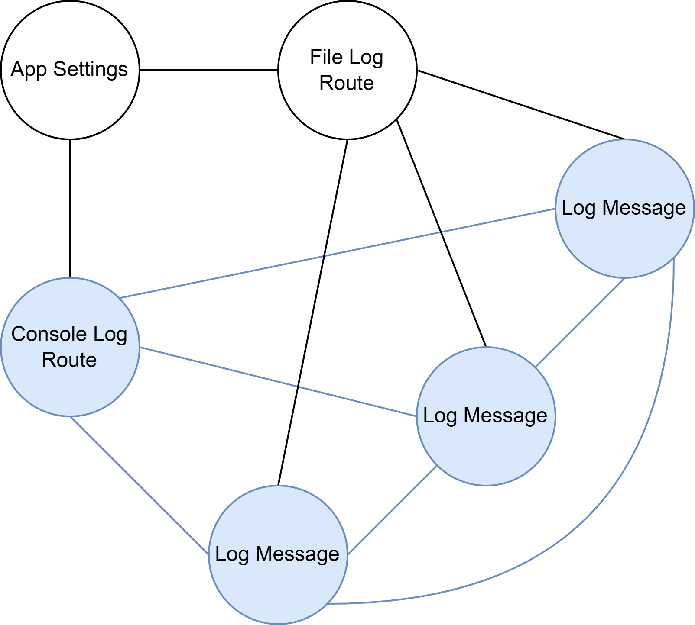

# 5.1  Compositions

## A Web of Association

As mentioned [earlier](../chapter-4-reacting-with-behaviors/4.1-revisiting-hello-world.md#the-concept-of-behavior), contexts bound to the same behavior instance form a relationship. They become associated with one another and indirectly with the other related contexts of each other. Considering this with respect to the logging feature that was implemented throughout the last chapter, it can be said that `App Settings` is associated with `Console Log Route` which is associated with, however briefly, any qualifying `Log Message` contexts before they are deactivated. If there were a `File Log Route` with similar relationships as `Console Log Route`, then it would also be associated with `App Settings` and its qualifying `Log Message` contexts, but not directly associated with `Console Log Route`.

A visualization of these relationships might look something like:

<figure><picture><source srcset="../.gitbook/assets/All-Contexts-Dark.png" media="(prefers-color-scheme: dark)"></picture><figcaption></figcaption></figure>

The associations between contexts form something like a web of app functionality. The web would grow and shrink as the application runs; some contexts may change their direct associates as the result of qualifying for different behaviors, while others may be added or removed. Since contexts bound to a behavior are persisted in memory, the full scope of this web not only shows the relationships of the app's contexts, but also what data is defining the [allocated memory footprint](#user-content-fn-1)[^1] of the application.

One or more of the contexts from this web define a "Composition". The following visualizations all depict compositions for the aforementioned web:

<figure><picture><source srcset="../.gitbook/assets/App-Settings-Composition-Dark.png" media="(prefers-color-scheme: dark)"></picture><figcaption></figcaption></figure>

<figure><picture><source srcset="../.gitbook/assets/File-Log-Route-Composition-Dark.drawio.png" media="(prefers-color-scheme: dark)"></picture><figcaption></figcaption></figure>

<figure><picture><source srcset="../.gitbook/assets/Console-Log-Route-Composition-Dark.png" media="(prefers-color-scheme: dark)"></picture><figcaption></figcaption></figure>

The purpose of compositions is to group contexts together for [activation](../chapter-4-reacting-with-behaviors/4.2-from-when-to-whenever.md#activating-together), deactivation, or potential [behavior-defined evaluation](5.1-compositions.md#behavior-defined-evaluation). They can be part of a normal evaluation, so as to be inputs to any operation.


## Building a Composition

To better discuss how compositions work, consider a common video game scenario where the following contexts [are defined](#user-content-fn-2)[^2]:

* `Character Id` - Identifies a game character.
* `Health` - Defines an amount of health that specifies whether a game element should continue to exist. When associated with a `Character Id`, through a behavior, it will enforce whether the identified character is alive or dead.
* `Armor` - Specifies some amount of protection to reduce incoming damage, thus preserving character health during an attack.
* `Attack` - Defines an attack from one character to another, including the strength and type of the attack.

Building a composition requires at least one context instance. For this scenario, the context instance would most likely be a `Character Id`, as its purpose is to be easily [passed around](#user-content-fn-3)[^3] for any operations that need to enact some change related to that character. With a `Character Id`, a composition can be built, as done in this operation:

```
Initiate Attack :: 
    initiates an Attack upon a target, identified by a Character Id : 
    operation <attack, target id>?
        target is {target id},
        `Initiate the attack`.
```

In the above example, a new composition called `target` has been created. The syntax shown is a short form for an alternative syntax, which would look like `target is Composition [target id]`. It consists only of the `target id` context instance. If the operation had the `Health` context as well, then the composition could have been made as follows:

```
Initiate Attack :: 
    initiates an Attack upon a target, identified by a Character Id with Health : 
    operation <attack, target id, health>?
        character is {target id, health},
        `Initiate the attack`.
```

These compositions are composed directly from the instances known to the operation. This has been seen [before](../chapter-4-reacting-with-behaviors/4.2-from-when-to-whenever.md#activating-together), with the in-line composition declaration for an activation. The alternative more explicit syntax would be `target is Composition [target id, health]`.

### Composition Expansion

The former example is more likely to be the implementation, where this specific operation only requires the attack and its target. The operation that actually handles the attack to reduce the health of the target would probably be in a behavior that creates the association between the `Character Id` and the `Health`.  However, given the relationship defined by the described behavior, the same composition of the latter can still be built in the former, just from that `Character Id` instance. This can be accomplished through the composition expansion operator, `#`, like so:

```
Initiate Attack :: 
    initiates an Attack upon a target, identified by a Character Id: 
    operation <attack, target id>?
        target is {target id},
        target is target # Health,
        `Initiate the attack`.
```

The `target` composition is now expanded with any `Health` contexts that the `target id` is associated with through their bound behaviors. Composition expansion basically walks on the web of association one step outwards from the contexts of an existing composition[^4] to grow the composition by any contexts of the [specified type](#user-content-fn-5)[^5] that it finds. To expand the `target` composition to include `Armor`, the example could use the line `target is target # Health # Armor,` instead of `target is target # Health`, or `target is target # (Health, Armor)`. There is a slight difference, in that the former will expand the already expanded composition (`target` and any `Health` contexts) and the latter will only expand the original `target` composition.

The example can be updated to take advantage of any contexts being implicitly cast to a composition:

```
Initiate Attack :: 
    initiates an Attack upon a target, identified by a Character Id: 
    operation <attack, target id>?
        target is target id # Health,
        `Initiate the attack`.
```

Now `target id` is implicitly cast to a composition, and then expanded by any associated `Health` contexts to form the `target` composition.

### Composition Reduction

The (mostly) opposite of composition expansion is composition reduction, performed by `!#`, where a composition is reduced by excluding any contexts of a specified type (or types). This doesn't walk back from the outer edges of the composition within the web of assembly, so much as it just excludes the contexts of the specified type, no matter where they are in the composition's subset of the web.

Given the `target` in the above example, where `target` only has the `Character Id` and `Health`, adding `health only is target !# Character Id` would declare a new composition, `health only`, that is composed only of any `Health` contexts that were associated with the `target id`. If `target` contained other contexts besides `Character Id`, then they would also be in the new composition. To build a composition of only `Health` contexts from the more complex `target`, the accessor (detail of) syntax can be used with the `Health` type as the detail, e.g., `health only is target (Health)`.

### Composition Replacement

The process of expanding a composition just to reduce it to the contexts it was just expanded to include can be fairly common. To accommodate this more clearly, Rede provides the replacement operator `<#`, so the `health only` composition could have been defined directly as `health only is target id <# Health`.


## Composition Types

The examples so far have only shown dynamic compositions. These are compositions that can be composed of any number of contexts, as only determined at the time that the compositions are formed. These are very useful, but it can also be useful to have an explicit shape expected for a composition, as can be defined by a composition type.

These types are declared similarly to contexts, outside of any operation. This example gives form to what a `Character` composition may be:

```
Character :: Character Id, Health, Armor : composition.
```

If a `Character` were expected to have two associated `Armor` contexts, then the composition may look like the following instead:

```
Character :: Character Id, Health, Armor, Armor : composition.
```

More likely, it may be possible for a `Character` to have any number of [different types](#user-content-fn-6)[^6] of `Armor`, so the composition may account for that by including a bucket of `Armor`:

```
Character :: Character Id, Health, {*Armor*} : composition.
```

Just like other types, composition types can be useful to restrict what kind of compositions an operation may accept. They can also be used with the composition fulfillment operator `>#`. This operator will attempt to expand a composition until it fulfills a specific composition type. If it can't, then it returns back the closest it [could get](#user-content-fn-7)[^7], potentially including other contexts that were already included in the composition.

This composition type and operator enables the example to be abstracted from the specific contexts that define a `Character`:

```
Initiate Attack :: 
    initiates an Attack upon a target, identified by a Character Id: 
    operation <attack, target id>?
        target is target id ># Character,
        `Initiate the attack`.
```

If the operation were to have instances for all parts of a composition type, then it could declare it directly with `target is Character {target id, health, armor}`, though that isn't a common case. The usefulness of doing this is to enforce the requirements of `Character` at compilation, to ensure any changes are reflected in such uses.


## Elements of a Composition

As shown, compositions are built with explicit context instances or by expanding with associated context instances, but the elements of a composition are not the contexts that were added. The elements of a composition are compositions. Despite compositions supporting indexing and iterating, a context cannot be directly pulled back out of a composition.

Given the `target` composition, indexing the first element with `target(0)` will provide the composition equivalent to `{target id}`. Even indexing that, `{target id}(0)`, will provide the composition equivalent to `{target id}`. This is due to how compositions are intended to provide a means of evaluation, but not means of providing direct access to any context at any time. Were any context available through the operations of composition expansion, it would become very difficult and non-performant for the runtime to manage parallel processing. By requiring evaluation of a behavior's operation to actually access the contexts of a composition, the runtime can properly schedule the execution of that operation with respect to other operations that may be using those contexts.

They can also be input to operations and can be changed the same as a context can by the operation, but they cannot be used as required contexts of behaviors (since they are not contexts). The position that compositions fill in Contextual Programming leads them to be a unique type of collection where the elements put into the collection cannot truly be retrieved, they can only be considered for evaluation.


Operations with input compositions may use the general `Composition` type or a specific composition type, although the latter is much more restrictive. There are other considerations to using compositions as inputs to operations, which are the same as they are for [operables](5.2-operables.md).



## Behavior-Defined Evaluation

As alluded to a few times, compositions are intended for evaluation purposes. Specifically, a composition allows the evaluation of operations that are within the behaviors that are bound to the contexts of that composition. The behaviors that will qualify for their operations to be evaluated are any that contain a subset of the composition. Behaviors, or more specifically behavior operations, bound to contexts outside of the composition do not qualify.

As a practical example of this, consider the `Character` composition created earlier. For the `Character` composition to be fulfillable[^8], there must be some behavior that is bound to at least the `Character Id` and at least one `Armor`, with an assumption that some other behavior binds the `Character Id` and `Health`. That first behavior, for this example, has an operation that requires an `Attack` context, and it uses the `Armor` context. Perhaps it looks something like the following:

```
Protect Character :: enables a character identified by a shared Character Id to 
    reduce incoming damage as specified by Armor : behavior {id, armor}
    when armor(wearer id) = id?
    
    Reduce Damage :: reduce Attack damage: <attack> for {armor} before all?
        `Alter the potential attack damage based on the armor`.
```

This `Protect Character` behavior doesn't do anything on its own, it isn't reactive or has any particularly noteworthy qualifications other than to make sure the `Armor` is supposedly worn by the character identified by the `Character Id`. However, it does enable the concept of a character, represented by the `Character` composition, to reduce the incoming damage of an `Attack` through its `Reduce Damage` operation. It will also do so before any other similarly qualified operations, such as an operation to actually reduce the character's health (through an associated `Health` context), are performed.

Looking back at the `Initiate Attack` operation, it could be updated as so:

```
Initiate Attack :: 
    initiates an Attack upon a target, identified by a Character Id: 
    operation <attack, target id>?
        target is target id ># Character,
        evaluate attack for target.
```

The new line `evaluate attack for target` brings everything together. That will initiate evaluation of any operations that require an `Attack`, and that are part of a behavior whose contexts are contained within the `target` composition. If `Character` includes the contexts for one or more instances of `Protect Character`, then `Reduce Damage` will be performed (for as many such instances that may exist). After any such operations the associated `Health` may finally be reduced by an operation in another behavior.

New functionality for how a `Character` responds to an `Attack` can be defined with new behaviors and their operations, possibly with new contexts that are added to `Character`, all without changing the `Initiate Attack` operation. The exact behaviors or operations may also change based on the qualifying behaviors for the state of the contexts at that moment. This adaptability is offered by compositions as an abstraction over the behaviors that maintain what happens during these evaluations and is a big part of completing Contextual Programming's concept of "when".

[^1]: This would be less than the total memory usage of the application at any given time though, since operations that are currently running would likely have local data that is in memory for performing logic and the runtime would require some memory as well to manage the contexts themselves.

[^2]: These contexts and their behaviors don't need to be detailed here, as the examples are only working with the concept of the contexts and aren't interested in what they are actually doing.

[^3]: Or serialized/deserialized with network messages for a multiplayer game.

[^4]: The composition containing `target id` in this case.

[^5]: Any `Health` contexts for this example.

[^6]: Although, perhaps there is not just an `Armor` for a game, there may be specific armor types or locations, such as `Chest Armor` or `Helmet`, but this example will assume a simple abstraction of `Armor` that could include any number of protection layers for the character.

[^7]: The actual return type of this operator is always a dynamic composition. It can't be reliably used to declare a variable of a composition type, but considering how compositions themselves are used dynamically, this isn't a concern.

[^8]: Meaning that there is some possible relationship between contexts that can permit the composition to be formed.
